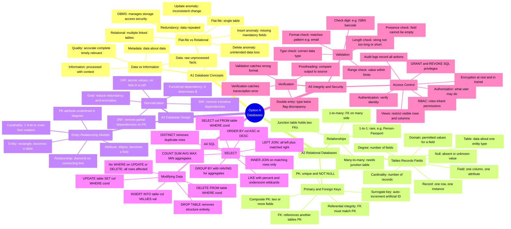
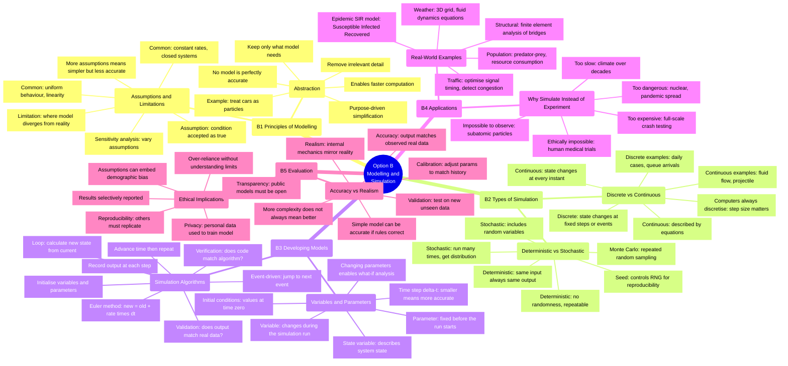
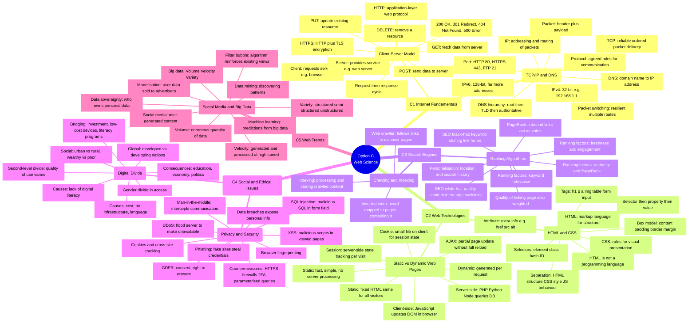

# IB Computer Science SL — Paper 2 Mindmaps
### One map per option · Print on separate pages · Black and white safe

> **Printing tip:** Open this file in VS Code (Mermaid Preview extension), Obsidian, or paste each diagram into [mermaid.live](https://mermaid.live), then print each map on its own A4 page using your browser's **File → Print** with "Background graphics" OFF. All diagrams use greyscale only.

---
---

## Option A — Databases

---
---

## Option B — Modelling and Simulation

---
---

## Option C — Web Science

---
---

## Option D — Object-Oriented Programming

```mermaid
mindmap
  root((Option D
OOP))
    D1(D1 Basic OOP Concepts)
      D1a(Classes and Objects)
        D1a1[Class: blueprint defining attributes and methods]
        D1a2[Object: a specific instance in memory]
        D1a3[Instantiation: creating an object from a class]
        D1a4[Constructor: initialises object on creation]
        D1a5[this or self: refers to current instance]
        D1a6[State: current values of attributes]
        D1a7[Behaviour: what the object can do]
      D1b(Attributes and Methods)
        D1b1[Instance attribute: unique value per object]
        D1b2[Class attribute: shared static across all objects]
        D1b3[void method: performs action returns nothing]
        D1b4[Value-returning method: returns a result]
        D1b5[Method signature: name plus parameter list]
        D1b6[Call: object dot methodName arguments]
    D2(D2 Encapsulation)
      D2a(Access Modifiers)
        D2a1[private: accessible within class only]
        D2a2[public: accessible from anywhere]
        D2a3[protected: class and its subclasses]
        D2a4[Information hiding: hide internal state]
        D2a5[Reduces coupling between classes]
        D2a6[Allows internal changes without breaking interface]
      D2b(Getters and Setters)
        D2b1[Getter accessor: returns private attribute]
        D2b2[Named getAttributeName by convention]
        D2b3[Setter mutator: sets value with validation]
        D2b4[Named setAttributeName by convention]
        D2b5[Getter only: creates read-only attribute]
        D2b6[Validation logic kept inside setter]
    D3(D3 Inheritance)
      D3a(Superclass and Subclass)
        D3a1[Superclass: parent base class being extended]
        D3a2[Subclass: child derived class that inherits]
        D3a3[Java syntax: class Dog extends Animal]
        D3a4[Inherits all public and protected members]
        D3a5[Can add new attributes and methods]
        D3a6[Can override superclass methods]
        D3a7[super: calls parent constructor or method]
        D3a8[Java: single inheritance only]
      D3b(Code Reuse)
        D3b1[DRY: Do Not Repeat Yourself]
        D3b2[Fix in superclass updates all subclasses]
        D3b3[is-a test: Dog is-an Animal - use inheritance]
        D3b4[has-a test: Car has-an Engine - use composition]
        D3b5[Deep hierarchies become hard to maintain]
    D4(D4 Polymorphism)
      D4a(Method Overriding)
        D4a1[Same name return type and params as superclass]
        D4a2[Different body in the subclass]
        D4a3[Override annotation: compiler verifies]
        D4a4[Dynamic dispatch: runtime picks correct version]
        D4a5[Animal a = new Dog - calls Dogs method]
        D4a6[Abstract method: no body, forces override]
        D4a7[Abstract class: cannot be instantiated]
      D4b(Method Overloading)
        D4b1[Same method name, different parameter list]
        D4b2[Different number or type of parameters]
        D4b3[Return type alone is NOT enough to distinguish]
        D4b4[Resolved at compile time: static polymorphism]
        D4b5[Constructor overloading: multiple constructors]
        D4b6[Overloading vs Overriding: same class vs subclass]
    D5(D5 Program Design)
      D5a(UML Class Diagrams)
        D5a1[Three-part box: name, attributes, methods]
        D5a2[Plus sign: public visibility]
        D5a3[Minus sign: private visibility]
        D5a4[Hash sign: protected visibility]
        D5a5[Attribute format: minus name colon DataType]
        D5a6[Method format: plus name params colon ReturnType]
        D5a7[Inheritance: solid line, open arrowhead to parent]
        D5a8[Multiplicity: 1, 0..star, 1..star on lines]
      D5b(Class Relationships)
        D5b1[Association: uses, both can exist independently]
        D5b2[Aggregation: weak has-a, part exists without whole]
        D5b3[Composition: strong has-a, part needs whole]
        D5b4[Aggregation: open diamond symbol]
        D5b5[Composition: filled diamond symbol]
        D5b6[Dependency: temporary use as method parameter]
    D6(D6 Programming Practice)
      D6a(Errors and Debugging)
        D6a1[Syntax error: violates grammar, caught by compiler]
        D6a2[Logic error: wrong output, found by testing]
        D6a3[Runtime exception: occurs during execution]
        D6a4[NullPointerException: method called on null]
        D6a5[ArrayIndexOutOfBoundsException: bad index]
        D6a6[try catch finally: exception handling]
        D6a7[White-box testing: tester has source code]
        D6a8[Black-box testing: tester knows only inputs and outputs]
        D6a9[Boundary testing: test at limits of valid range]
      D6b(Tracing Algorithms)
        D6b1[Trace table: one column per variable]
        D6b2[One row per step or loop iteration]
        D6b3[Track loop counters and condition results]
        D6b4[Note every assignment and output statement]
        D6b5[For recursion: track the call stack]
        D6b6[Always record final output and return values]
```

---

## Reading the Maps

**How to use these four maps:**

- **Spot gaps** — any leaf node that draws a blank → go back to `IBCS_Paper2_Revision.md` for that sub-topic.
- **Self-quiz** — cover the outer nodes; try to recall them from the topic labels alone.
- **Last-minute sweep** — read every leaf node once before walking into the exam hall.

**Printing (black and white):**

| Step | Action |
|------|--------|
| 1 | Open this file in [mermaid.live](https://mermaid.live) — paste one diagram at a time |
| 2 | Click **Actions → PNG** to download each map as an image |
| 3 | Print each PNG on its own A4 sheet, landscape orientation for best fit |
| 4 | Alternatively, open in Obsidian or VS Code (Mermaid Preview extension) and print directly |

All node labels use plain text only — no special characters that would break Mermaid parsing.

**Editors that render Mermaid natively:**

| Editor | How |
|--------|-----|
| VS Code | Install *Mermaid Preview* extension |
| Obsidian | Built-in — enable in Settings → Core Plugins |
| GitHub / GitLab | Auto-renders in `.md` files in any repo |
| mermaid.live | Paste and preview instantly — best for printing |
| Typora | Built-in rendering |
