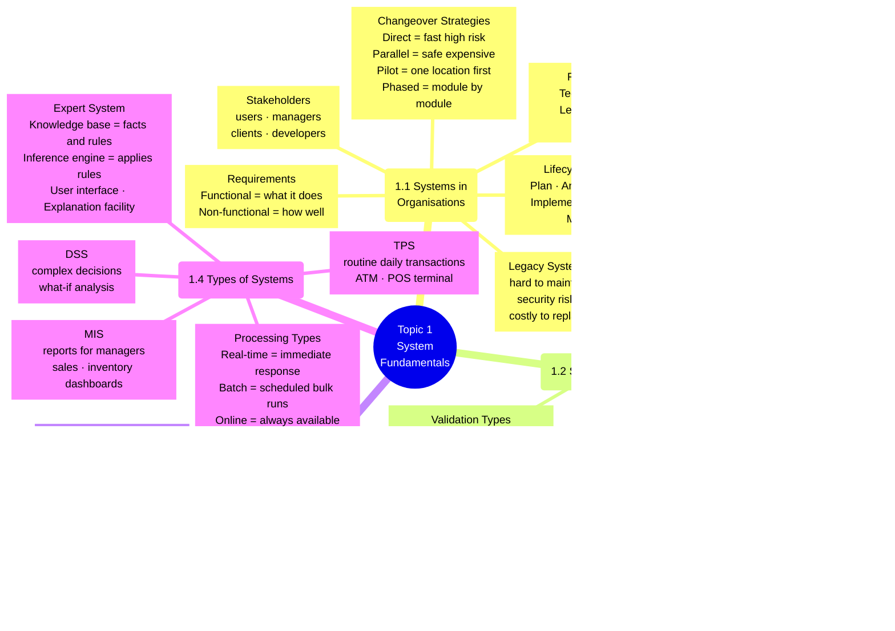
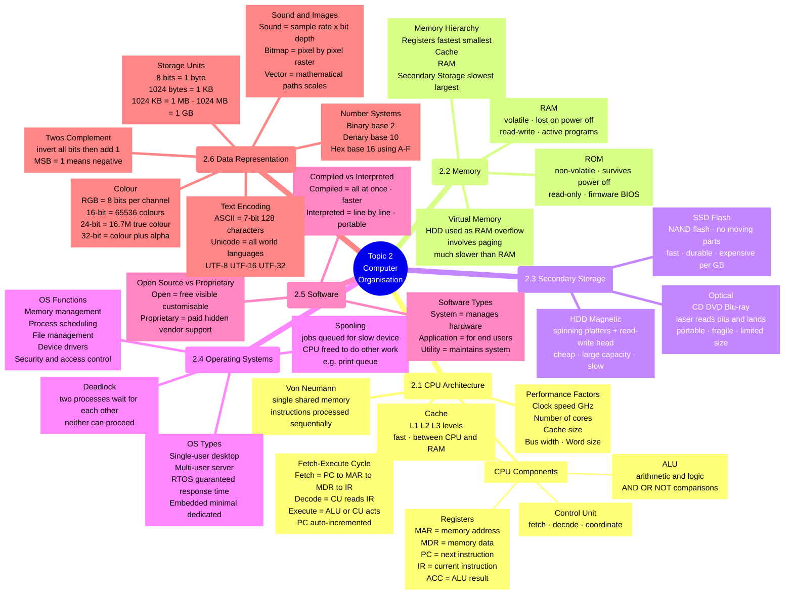
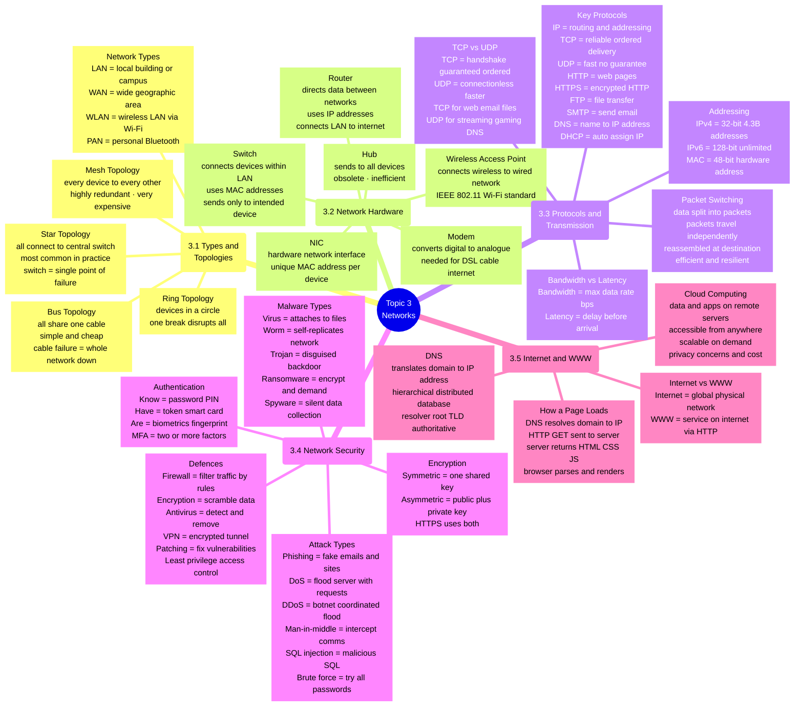
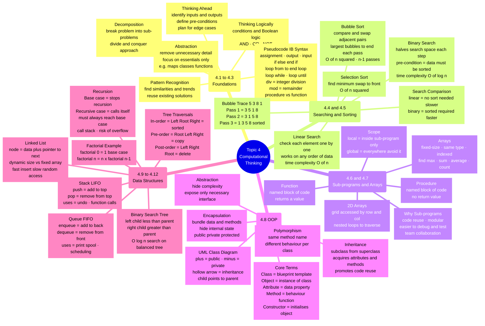

# IB CS SL — Paper 1 Mind Maps (One Per Topic)

> Source: `IBCS_lastminute_revision.md`  
> Each topic has its own diagram for readability. Open in VS Code (Mermaid Preview), Obsidian, Typora, or GitHub to render.

---

## Topic 1 — System Fundamentals

---

## Topic 2 — Computer Organisation

---

## Topic 3 — Networks

---

## Topic 4 — Computational Thinking, Problem-Solving & Programming

---

## Reading the Maps

Each diagram above covers one Paper 1 topic in full. Nodes use these shapes:

- **`(( ))`** — topic root (circle)
- **`( )`** — sub-topic heading (rounded rectangle)
- **`[ ]`** — concept/fact node (rectangle)

| Diagram | Topic | Sub-topics covered |
|---|---|---|
| **Map 1** | System Fundamentals | 1.1 – 1.4 |
| **Map 2** | Computer Organisation | 2.1 – 2.6 |
| **Map 3** | Networks | 3.1 – 3.5 |
| **Map 4** | Computational Thinking | 4.1 – 4.12 |

> **Rendering:** VS Code with *Mermaid Preview* extension · Obsidian (native) · Typora · GitHub markdown preview · The HTML file (`IBCS_Paper1_Revision.html`) renders all four maps via Mermaid.js in any browser.
